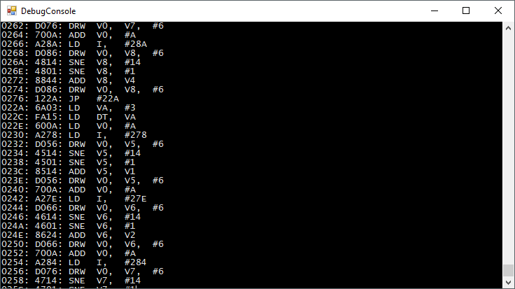

# CHIP8Emulator
This is my take on the CHIP-8 emulator written in C#

## What is CHIP-8
CHIP-8 is an interpreted programming language, developed by Joseph Weisbecker. It was initially used on the COSMAC VIP and Telmac 1800 8-bit microcomputers in the mid-1970s. CHIP-8 programs are run on a CHIP-8 virtual machine. It was made to allow video games to be more easily programmed for said computers.
Source: [en.wikipedia.org/wiki/CHIP-8](en.wikipedia.org/wiki/CHIP-8)

## Features
 Loading, and running a standard CHIP-8 rom file
 
 

 A debug console, that shows the current operation being executed - in assembly format
 
 
 
 A debug window, that shows the current state of the registers, program counter, stack, the currently executed opcode, etc. It also allows you to start, pause, and step the execution by a single cycle.
 
 
 
 A memory map, that show the all the 4096 bytes of the memory

 

## Projects in the solution
 * CHIP8Emulator: This project contains the emulator infrastructure
 * CHIP8Library: this is the CHIP-8 emulator itself
 * CHIP8EmulatorTestApp: I have tested various features of the lib in this console app

## Submodules
It uses the SimpleSDLWrapperDotNET library to display graphics, and play sound
[https://github.com/notisrac/SimpleSDLWrapperDotNET](https://github.com/notisrac/SimpleSDLWrapperDotNET)

## Thanks to
 * Laurence Muller - [www.multigesture.net](www.multigesture.net)
 * Martijn Wenting - [www.revival-studios.com](www.revival-studios.com)
 * Matthew James Mikolay - [www.mattmik.com](www.mattmik.com)
 * [www.chip8.com](www.chip8.com)
